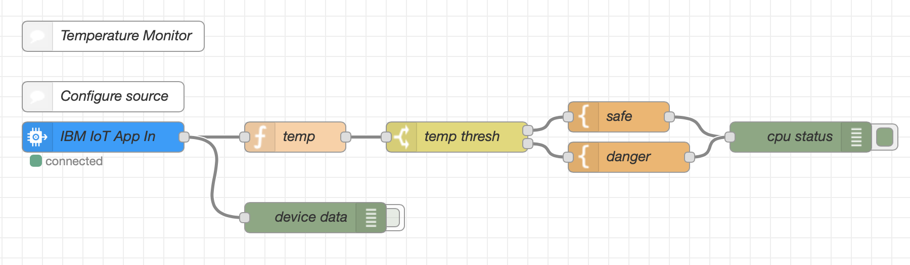

# IoT2020
This is a repository on IoT, Edge, Machine Learning, and AI used in Robotics projects run from IBM Cloud

## Intro to IoT in IBM Cloud
- Step one - singup for free *LITE* account with IBM Cloud - use this link: http://ibm.biz/20191219
- Step two - create Node.Red service
- Step three - add IoT - look at the video on adding Watson IoT Platform : https://youtu.be/rG6Dm5cyTss
- Step four - use a virtual sensor: http://ibm.biz/iotsensor
- Step five - use the basic flow to read the temp

```json
[{"id":"3e77d543.c1882a","type":"ibmiot in","z":"deb0d57.1c46528","authentication":"quickstart","apiKey":"","inputType":"evt","logicalInterface":"","ruleId":"","deviceId":"","applicationId":"","deviceType":"+","eventType":"+","commandType":"","format":"json","name":"IBM IoT App In","service":"quickstart","allDevices":false,"allApplications":false,"allDeviceTypes":true,"allLogicalInterfaces":false,"allEvents":true,"allCommands":false,"allFormats":false,"qos":"0","x":100,"y":400,"wires":[["ae0082ac.51ff8","c0c482df.3f3b8"]]},{"id":"ae0082ac.51ff8","type":"function","z":"deb0d57.1c46528","name":"temp","func":"return {payload:msg.payload.d.temp};","outputs":1,"x":290,"y":400,"wires":[["ff6ad0d9.00953"]]},{"id":"ff6ad0d9.00953","type":"switch","z":"deb0d57.1c46528","name":"temp thresh","property":"payload","propertyType":"msg","rules":[{"t":"lte","v":"38","vt":"str"},{"t":"gt","v":"38","vt":"str"}],"checkall":"true","repair":false,"outputs":2,"x":450,"y":400,"wires":[["80621eff.7f9de"],["8e1706a.f71e8f8"]]},{"id":"5dad02b7.a252fc","type":"debug","z":"deb0d57.1c46528","name":"cpu status","active":true,"complete":"false","x":790,"y":400,"wires":[]},{"id":"c0c482df.3f3b8","type":"debug","z":"deb0d57.1c46528","name":"device data","active":false,"tosidebar":true,"console":false,"complete":"true","x":310,"y":480,"wires":[]},{"id":"80621eff.7f9de","type":"template","z":"deb0d57.1c46528","name":"safe","template":"Temperature ({{payload}}) within safe limits","x":610,"y":380,"wires":[["5dad02b7.a252fc"]]},{"id":"8e1706a.f71e8f8","type":"template","z":"deb0d57.1c46528","name":"danger","field":"payload","fieldType":"msg","syntax":"mustache","template":"Temperature ({{payload}}) critical! Watch out for health of a hamster!!!","x":620,"y":420,"wires":[["5dad02b7.a252fc"]]},{"id":"7926c7b2.86d938","type":"comment","z":"deb0d57.1c46528","name":"Temperature Monitor","info":"","x":110,"y":300,"wires":[]},{"id":"188a5e87.e775a1","type":"comment","z":"deb0d57.1c46528","name":"Configure source","info":"","x":100,"y":360,"wires":[]}]
```


- Step six - update the node of `IBM IoT App In` with the id of the virtual sensor (upper right number seen on the face of the virtual temp sensor from step four) for the Quickstart authentication
- Step seven - use the button `Deploy` to update and run the flow
- Step eight - observe the change of the logs in the debug, when changing the temperature. What happens when the temp in Celcius exceeds 38C?
- more information is provided in this blogpost by John Walicki: https://developer.ibm.com/tutorials/how-to-create-an-internet-of-things-platform-starter-application/

## TBC ...

Follow me on twitter: *blumareks*
